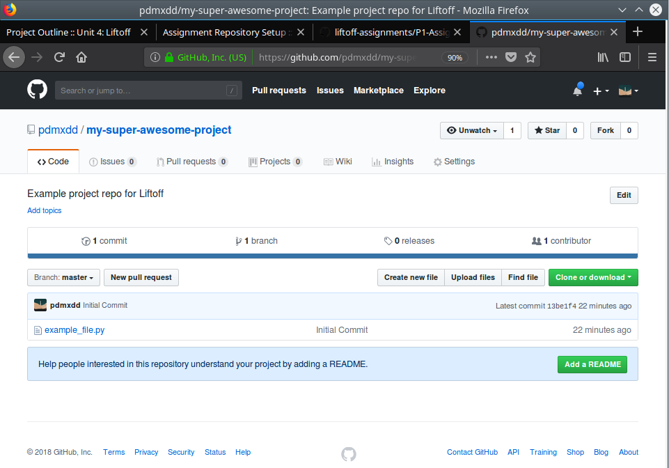
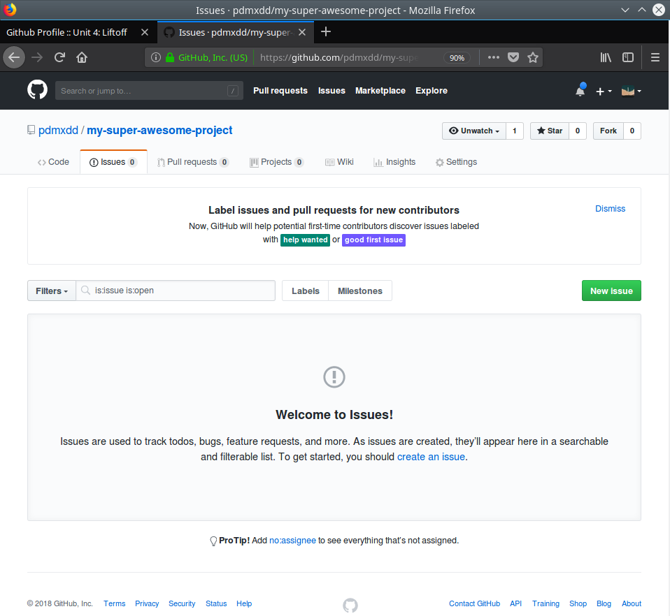
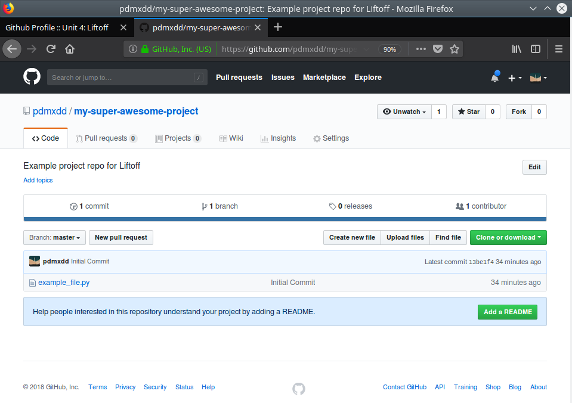
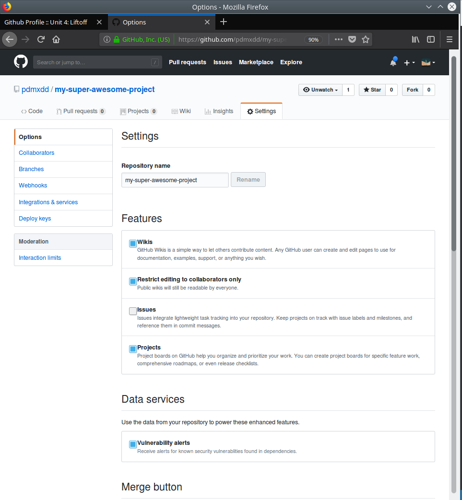

## Standard GitHub Repository

In order to receive feedback from your Mentor you will need to enable GitHub Issues. GitHub Issues is usually setup automatically for new repositories.

Here is a picture of an example GitHub Project Repo.

The tabs for this project are Code, Issues, Pull requests, Projects, Wiki, Insights, and Settings.

If I click the Issues tab it looks like this.

My issues are already enabled! I can create a new issue by clicking the large green New Issue button.

## Enabling GitHub Issues

Let's look at the same repository after I have turned off Issues in the settings tab.

You can see that the Issues tab is no longer present!

In order to turn this on I must select the Settings tab.

The settings page has a ton of configurable options, you should look around and see what is possbile! On the Main page shown above you can see the big Features heading in that heading are 4 checkboxes, and the Issues checkbox is unchecked. By clicking that checkbox, it will enable the Issues tab.

When I check the Issues button it automatically takes effect, and you can see from the image above that it adds the Issues tab back in for me!