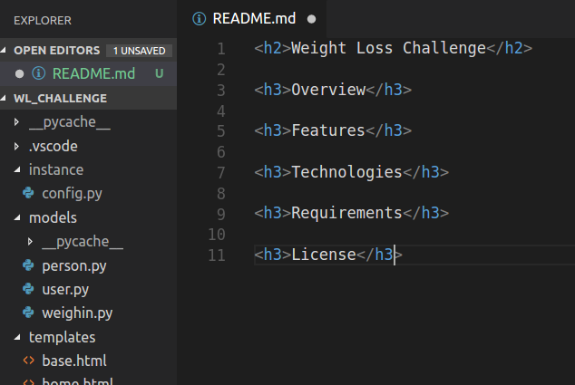

## Creating a Github Readme

This walkthrough will show you how to add a Github Readme to your project by adding it to your local repository, and then pushing it to your remote github repository.

### Change into Directory

You will first need to change into the local repository where your project lives. Then we will want to check to make sure a README.md file does not already exist.

You can see in my directory there are only 2 files, and a couple of folders, an app.py file, and a main.py file. A README.md file does not already exist.

### Create README.md

So let's create this new README.md file in my root project directory and open it up with a code editor!

<aside class="aside-hint" markdown="1">I will create and open the file at the same time by using the command `code README.md` This tells my computer to open a file in Visual Studio Code called README.md, and if it doesn't exist to create it. You can create, and open your file with whatever editor, or IDE you wish. You just need to make sure the file is in your project's root directory!</aside>

We just created a new markdown file which gives us the ability to add content, and to format the text of the file. A benefit of a markdown file is that they work seamlessly with HTML, so many of the tags you use in HTML are avaiable to you in a markdown file.

### Add README.md Headers

Let's add the headers of our project README.md file.

Projects will have different readmes, for a demo project you are showing to a potential employer you want to include the information they are most interested in. They will need to know the project name, an overview of your project, the skills you used to build your project, the features you intend on adding next, etc. Let's add a few of those sections now so we remember what we need to include.

You may also want to include a License, Project Requirements, Screenshots of the project in action, Wireframes, User Stories, a link to your live project, a highlight of a feature you are proud of, or that was difficult to implement. 

Your project README.md is your chance to really show the interviewer what you had to do to complete this project!

### Add content to README.md Headers

After stubbing out the sections you need to complete for this specific README.md you need to add to each section.

You will notice I am using HTML tags to build my README.md file.

### Save, add, commit, and push README.md

Finally we will need to save, add, commit, and push our readme to the remote repository.

First I check the remote repository with `git remote -v`.

I then check the repo status with `git status`

I then add the README.md with `git add README.md`

I then commit the changes `git commit -m "Add Readme"`

I then push to the remote repository `git push origin master`

### Check Github Repo

Finally I look at the Github repo to ensure my README.md was added, and is displaying correctly.

That's it! The README.md file now exists and renders correctly. As I add to my project, I need to make sure I update the README.md accordingly.
