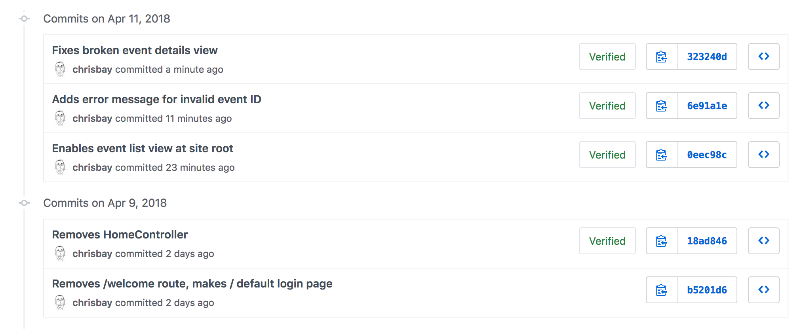

## Quick Links

- [Assignment Repository for Event Log](https://github.com/chrisbay/liftoff-assignments)
- [Event Log GitHub Repository](https://github.com/chrisbay/event-log)
- [Pivotal Tracker Project](https://www.pivotaltracker.com/n/projects/2157573)
- Jump to week: [1](#week-1) | [2](#week-2) | [3](#week-3) | [4](#week-4) | [5](#week-5) | [6](#week-6) | [7](#week-7) | [8](#week-8)

## Overview

For his Liftoff project, Chris has decided to work on an application movitivated by a need expressed by a nonprofit organization. This page will outline the steps that he follows in developing his project, completing each of the Liftoff assignments along with completing user stories and participating in the weekly agile ceremonies like stand-ups and project kickoffs.

## Week 1

### Sprint 1 Kickoff

Most sprint kickoffs will consist of planning estimating, and committing to user stories to complete during the sprint. Since there are not user stories created yet (we'll do that in week 2) this kickoff is a litle different.

We discussed our project ideas--Chris' for an event log and Paul's for an expense tracker--and got some feedback on how big each project might be to be doable. We also discussed the particular technologies that we'll be using to build our projects.

Finally, we discussed the things that we expect to have to learn along the way, beyond what we already know. Paul will be using a new-to-him framework called Rocket (for the Rust programming language), while Chris has some unknowns around how user authentication will work. 

### Assignment: Project Outline

The [project outline](https://github.com/chrisbay/liftoff-assignments/blob/master/P2-Project_Outline/) for Event Log gives an overview of the desired functionality.

## Week 2

### Sprint 1 Standup

During our sprint 1 standup, we discussed our completed project outlines and upcoming work. Here are Chris' items.

**What was accomplished:** The Event Log project outline was completed, with a few features laid out. Some questions were raised about how to approach different things (e.g. user login) that we'll have to be figured out along the way.

**What is planned next:** Next, wireframes and initial user stories will be developed.

**Blockers:** 
There aren't any significant blockers, though there are some unknowns that were made clear as part of this early planning. In particular, Chris has done some research around using Spring Security framework to handle user authentication, though that seems like a potential challenge.

### Assignment: Project Planning

The [Project Planning](https://github.com/chrisbay/liftoff-assignments/blob/master/P3-Project_Planning/) includes 3 initial wireframes for the Event Log app, along with a link to the Pivotal Tracker project that has been populated with some user stories.

Here's a screenshot of the tracker with initial user stories.

## Week 3

### Sprint 1 Review and Retrospective

For the sprint review/retro Chris and Paul discussed the work completed during the first. Both completed initial project planning and setup. Working through some details such as wireframes and user stories helped clarify the initial work to be done, which will begin in earnest this week as the second sprint kicks off.

During the retrospective portion of the discussion, the discussed how in some ways it didn't feel like much had gotten done since there wasn't much, if any, code written. Paul made the point that while little code was written, the planning that was done should help the initial coding phase of the project go more quickly than it otherwise would. He noted that if a programmer just jumps into a project without designing and planning the work to be done, a lot of time can be wasted in doing things inefficiently, reworking portions of the app, and generally figuring out how it should be structured. Doing this work up front should make things go more smoothly from now on!

### Assignment: Project Setup

[Assignment submission in `liftoff-assignments`](https://github.com/chrisbay/liftoff-assignments/tree/master/P4-Project_Setup)

The project's [GitHub repository](https://github.com/chrisbay/event-log) was set up. Initial commits created a basic "Hello world" Spring Boot app obtained via [start.spring.io](http://start.spring.io/). They also add some basic dependencies in the [`build.gradle`](https://github.com/chrisbay/event-log/blob/3f91742a0527a65e64678c477d50f26a98b87f3e/build.gradle) file for jQuery and Bootstrap (from the `org.webjars` group).

### Sprint 2 Kickoff

For the second sprint, Chris plans on working through the initial user stories, which are each focused on one aspect of user registration and authentication. He has reviewed the [`spring-filter-based-auth` example](https://github.com/LaunchCodeEducation/spring-filter-based-auth) provided by LaunchCode, and may use that approach. However, he has been learning about Spring Security and wants to see if he can use that framework for setting up registration and login.

He hasn't used Spring Security before, and it looks like it could be complicated to set up. To get started, he's going to refer to the [Spring Security Series](http://www.baeldung.com/security-spring) of articles at [baeldung.com](http://www.baeldung.com/), which seem well-written and thorough. The only challange may be in modifying the complex examples for his more straightforward situation.

He has estimated the user stories that he feels confident he can complete this sprint, and moved them into the **Current Iteration** column of Pivotal Tracker.

The first story he'll work on will be, "As a user, I can create an account so that I can access the app." The other stories are focused on logging in and out, and one can't log in or out without and existing account, so it makes sense to start this one first. To verify that account registration works, he'll be able to check the database.

Setting up account registration will require him to set up his first model class, `User`, as well as setting up the app's database. Some other initial, one-time work--such as creating some shared template fragments--will also need to be done.

If he completes all of these, there are more stories ready to estimate and begin in the **Backlog**.

## Week 4

Since there wasn't a Project Module assignment for week 4, the focus was on completing user stories and gaining momentum.

### Sprint 2 Standup

**What was accomplished:** All of the user registration and login stories are complete! (See associated commits and screenshots below.) Chris didn't expect to get as much done, but he was able to get all of the desired features implemented.

[View the codebase](https://github.com/chrisbay/event-log/tree/189caaa1e1e8e8cae0f4a57bec71f41911d486ee) for `event-log` as of the sprint 2 standup.

**Screenshots:**

- [Event Log Registration](images/event-log-register.png)
- [Event Log Login](images/event-log-login.png)
- [Event Log Welcome](images/event-log-welcome.png)
- [Event Log Logout](images/event-log-logout.png)

**What is planned next:** Next, Chris will work on building out the event model classes, along with associated controllers and views. He has estimated a few stories and moved them into the **Current Iteration** column (see Pivotal Tracker screenshot below). Right now, they seem like a lot of work to complete with only one week left in the sprint, but he's going to get as much done as he can.

**Blockers:** At this point, there are no blockers. The tasks ahead are much like the tasks to create `Cheese` objects used in `CheeseMVC`, so there are no obvious rough spots ahead for the current tasks.

## Week 5

For week 5, the focus was on continuing to complete user stories, while also getting a code review from a mentor. With a few stories having been completed, and a solid base of code in place, it's a good time to get review the project with a more experienced developer to get some feedback. If there are better ways to approach things, or to structure your code, it will be easier to refactor now than it will be later!

### Sprint 2 Review and Retrospective

For the second week of sprint 2, Chris was able to compete a couple more user stories:

- As a logged-in user, I can create a new event
- As a logged-in user, I can view event details on a single page, so I can see full event information

**Screenshots:**

- [Create Event View](images/create_event_form.png)
- [Event Details View](images/event_details_view.png)

He had estimated another story and moved it to the **Current Iteration** panel ("As a logged-in user, I can view all upcoming events...") but he was unable to get started on it. This story will carry over to the next sprint.

Here are the commits made during the second half of sprint 2:

There were a few commits that consisted not of new stories, but of small amounts of _refactoring_. It's a common and important task to constantly work to improve a code base via refactoring. Here are some specific types of refactoring tasks carried out this past week on the project:

- Renaming classes or packages to be more reflective of their purpose.
- Adding overrides to `equals` and `hashCode` where it makes sense to do so.
- Removing a class property when it becomes clear that it is not currently used or needed.

Looking back at the full sprint, a lot was accomplished on two weeks. User authentication was added, and the first non-user model class was implemented, making the app usable at a basic level. There will be additional model classes to add in future sprints, including some that have relationships with `User` and `Event`, but to have these initial classes in place with working code is a great accomplishment!

### Assignment: Project Review

For the project review, Chris and Paul sat down to discuss and look at the work done to-date. Chris gave Paul a demo of the applications as it stands, and they then began looking at the application code itself.

By working in small units and refactoring as he goes, Chris has kept his code clean and readable. There is no "dead code" (i.e. code no longer being used), commented-out snippets, or messy files.

He had a few comments on things that could be improved:

#### Changing user passwords

Paul noted that there isn't currently a way for users to change or reset their passwords. This will be necessary in the long run (definitely before the app is to be used by the general public), but probably isn't a short-term concern.

#### UI improvements

He also noted that for some of the newer features, while they work well, the UI and template work is sloppy. There is no way to click on a link and go to the Create Event form. The main event listing at `/` shows event titles and dates, but the dates aren't formatted very nicely. Additionally, users should be able to click on an event and go to the details page for that event.

#### Organization support

Paul and Chris also talked about the fact that the app only supports use by a single organization. In other words, the app assumes that only one organization is using it, and so events don't "belong to" any type of organization. This is somewhat limiting.

Chris commented that he'd like to add support for multiple organizations in the future, but for he wants to focus on building out core functionality for working with events. Paul agreed that this is a good short-term strategy, and the app could always be modified in the future to support use by multiple organizations. Trying to add that functionality now would certainly slow down the addition of core event functionality.

Based on the code review, Chris added a couple of tasks to Pivotal tracker to improve aspects of the user interface. He estimated these as 0 points, since they aren't user stories that add specific functionality.

### Sprint 3 Kickoff

The focus of sprint 3 will be adding additional functionality around viewing and editing events. The stories for the first week of the spring have been estimated and moved to the **Current Iteration** column:

The first two stories--viewing a listing of events, and adding a user-friendly message for bad event IDs--are medium and small in size. The third story--enabling editing of events after they have been created--is larger and is a stretch goal. Chris may get to it, or he may not, but putting it in the **Current Iteration** column gives him something ambitious to shoot for.

<aside class="aside-pro-tip" markdown="1">
Note that Chris is adding functionality in very small increments. While he has created the `Event` model class and is working to add CRUD functionality to that object, he has intentionally left off model properties that he knows he will need later. In particular, the ability to add a volunteer to an event does not exist in the current model design. This allows him to focus on solidifying core functionality and working in small increments. <i>Be wary of creating user stories that become too large, or bleed into other functionality!</i>
</aside>

## Week 6

### Sprint 3 Standup

**What was accomplished:** In the first week of sprint 3, Chris completed two user stories:

- As a logged-in user, I can view all upcoming events immediately upon logging in, so I can quickly get a view of upcoming events. ([screenshot](images/event_listing_view.png))
- As a logged-in user, when I try to view an event with an ID that doesn't exist, I see a helpful error message. ([screenshot](images/event_error_message.png))

He did not meet his stretch goal of implementing event editing. That will be the focus of the rest of the sprint.

Even though only two stories were finished there were several commits, including some refactoring, clean up, and a bug fix:

[View the codebase](https://github.com/chrisbay/event-log/tree/323240db297918fc5d2053c173186d868b096f34) for `event-log` as of the sprint 3 standup.

**What is planned next:** For the rest of the sprint, Chris will focus on adding the ability to edit events that have already been created. He also hopes to work on some of the UI improvements that he and Paul discussed during last week's code review.

Here's the current status of the **Current Iteration** tasks:

**Blockers:** Chris doesn't have any blockers at this point.

## Week 7

### Sprint 3 Review and Retrospective

In the final week of spring 3, Chris completed the following stories:

- As a logged-in user, I can edit event details so I can fix mistakes and add information after the event has been created.
- As a logged-in user, when when viewing the main listing of events, I can click on an event row to see the event details.
- Improve event listing view.
- Improve event details view.

The last two "stories" aren't actually written as user stories, as you likely noticed. They also were given 0-point estimates. This is because they are refactoring tasks which don't add any new features to the application.

The stories completed include one additional story beyond what was planned as of the last standup. Chris finished the planned tasks and decided to tackle the story: "As a logged-in user, when when viewing the main listing of events..."

As part of the work improving views, he added a Bootstrap theme from the [Bootswatch](https://bootswatch.com/) project to give the site some additional character.

Check out some screenshots of the new work, as well as the refactored views with the new theme:

- [Event Listing View](images/event_listing_view_new.png)
- [Event Details View](images/event_details_view_new.png)
- [Create Event Form](images/create_event_form_new.png)

There were quite a few commits for this week's work, since many of the changes were small, atomic refactoring tasks:

[View the codebase](https://github.com/chrisbay/event-log/tree/38256230b30e5bb7f0d9325e69f41c8bf68c3e2b) for `event-log` as of the end of sprint 3.

### Sprint 4 Kickoff

To start spring 4, Chris will focus on adding volunteer tracking to the system. The goal is to allow users to create volunteers, and add multiple volunteers to an event. He'll also make events deletable.

Here's the current status of the **Current Iteration** tasks:

## Week 8

### Sprint 4 Standup

**What was accomplished:** Chris completed the following stories:

- As a logged-in user, I can delete an event
- As a logged-in user, I can add a new volunteer to the system
- As a logged-in user, I can add a volunteer to an event
- As a logged-in user, I can remove a volunteer from an event

The final story listed wasn't estimated, but in the course of implementing the ability to add volunteers to events, it made sense at the time to also make sure that removing volunteers (via the update event view) worked as well. In other words, based on the code being written it was just as easy to do those two stories at the same time.

[View the codebase](https://github.com/chrisbay/event-log/tree/edd52171e49ea49fb8c2812698b2e10ed5ed5275) for `event-log` as of the sprint 4 standup.

**What is planned next:** For the next sprint, Chris will focus on some stories that were discussed with Paul during his project review that are focused on navigating event listings.

Here's the current status of the **Current Iteration** tasks:

While Liftoff is over, Chris will continue to work on his project on a regular basis and will continue to plan his work using user stories and sprints.

**Blockers:** Chris hasn't used the `PagingAndSortingRepository` before, so he'll need to learn about that before starting the stories for this sprint. He's already identified [an article](http://www.baeldung.com/spring-data-repositories) that gives a nice overview of the repository interface.

### Project review

For the last week of Liftoff, Paul and Chris conducted another project review of the Event Log project. Since the last project review, Chris has done a lot of work to tighten up the look and functionality of the app.

While all of that work was good, it has also made it apparent that there are a few basic behaviors that most users would expect the app to support. In particular, events are not sorted in the main listing. Most people would expect them to be sorted by date.

On the same note, Chris and Paul discussed use cases around upcoming and past events. Some users might prefer to see one or the other. After discussing options, Chris decided to show _both_ upcoming and recent events on the main listing, but in separate sections, and to create new views that display only recent events and only upcoming events. These will be linked from the main navigation as well as from the main event listing.

Finally, Paul brought up the fact that while the event listing looks good now, if there was a large number of events in the system (as would eventually happen in actual use) then it would be hard for the user to navigate the page. And each time that the user displayed the page a large number of records would be returned from the database even if most wouldn't be relevant to what the user wanted to see.

Paul suggested that Chris implement paging for his event listing views, displaying a fixed number of events per pages along with links to view next/previous pages. He mentioned that he knew Spring Data has a repository interface, [`PagingAndSortingRepository`](https://docs.spring.io/spring-data/commons/docs/current/api/org/springframework/data/repository/PagingAndSortingRepository.html), made just for this purpose.

### Assignment: Project Presentation

[View Chris' Project Presentation](project-presentation.pdf)